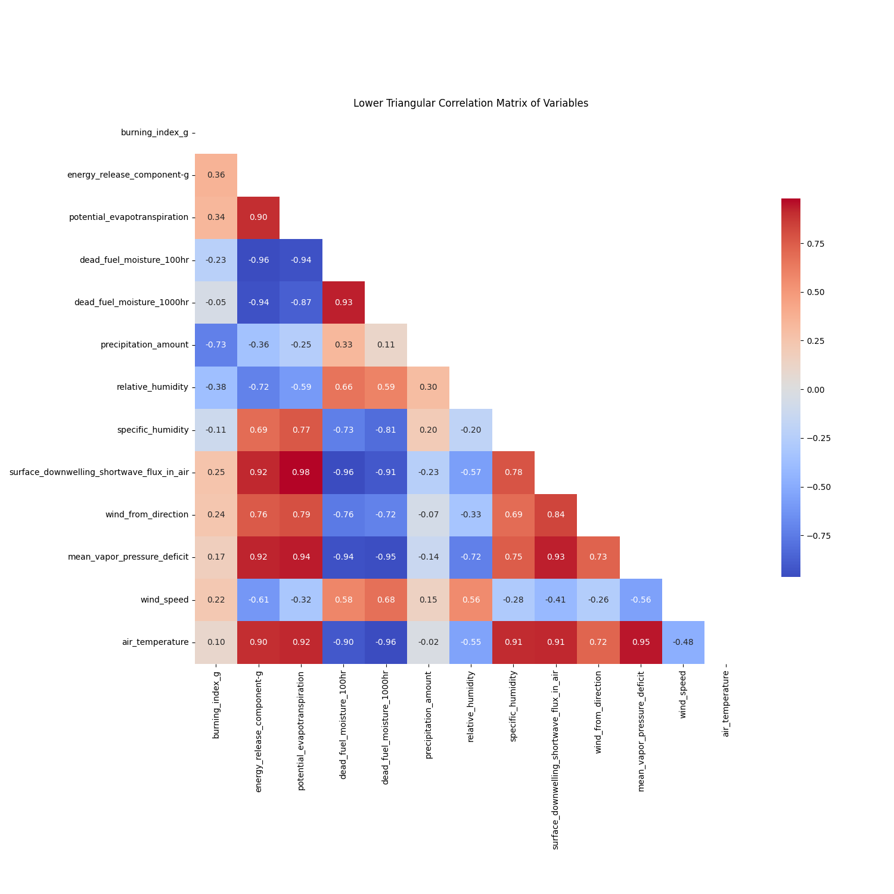

# ColorMapping

## Directory Structure

```
SciVis/
    colorMapping/
        animation_1.py
        animation_2.py
        createAnimation.py
        ...
```

## Files

### `correlation.py`

This script is used to generate a correlation matrix for the ```sampled_data```

### `animation_1.py`

This script is responsible for generating animations using color maps and normalization techniques. It contains configurations for different types of animations and saves the generated images. This file majorly deals with the generation of plots of burning index and the correlated values in the picture given below. 

### animation_2.py


Similar to `animation_1.py`, this script also generates animations but with a different set of configurations. It includes options for global and local normalization, and various color maps. This file majorly deals with the generation of plots of burning index and the correlated values after performing an ablation study.

### createAnimation.py

This script creates GIF animations from a sequence of images stored in a specified directory. It uses  ```matplotlib.animation``` to generate the animations as GIFs.

### Other directories

Contain images of different color mapping techniques. The ```gifs``` directory contains gifs generated by ```createAnimation.py```. 


## Usage

### Generating Animations

To generate animations, you can run either `animation_1.py` or 

animation_2.py

. These scripts will generate images based on the configurations defined within them.

```sh
python animation_1.py
# or
python animation_2.py
```

### Creating GIFs

Once you have generated the images, you can create GIFs using the 

createAnimation.py

 script. This script will read the images from the specified directories and create GIFs.

```sh
python createAnimation.py
```

## Example

Here is an example of how to use the 

createAnimation.py

 script:

```python
import matplotlib.pyplot as plt
import matplotlib.animation as animation
import imageio
import os

def create_animation(image_folder, output_file):
    file_names = sorted([f for f in os.listdir(image_folder) if f.endswith('.png')])
    
    fig, ax = plt.subplots()
    ax.set_axis_off()
    img = plt.imread(os.path.join(image_folder, file_names[0]))
    im = ax.imshow(img)
    
    def update(frame):
        img = plt.imread(os.path.join(image_folder, file_names[frame]))
        im.set_array(img)
        return [im]
    
    ani = animation.FuncAnimation(fig, update, frames=len(file_names), blit=True)
    os.makedirs("gifs", exist_ok=True)
    ani.save(f"gifs/{output_file}.gif", writer='pillow', fps=2)

if __name__ == "__main__":
    image_folders = ["animation_continuous_inferno", "animation_discrete_YlOrRd", "animation_log_continuous_inferno", "global_animation_continuous_inferno"]
    output_files = ["continuous_inferno", "discrete_YlOrRd", "log_continuous_inferno", "global_inferno"]
    
    for image_folder, output_file in zip(image_folders, output_files):
        create_animation(image_folder, output_file)
```

This script will create GIFs from the images stored in the specified directories and save them in the ```gifs``` directory.

## Dependencies

Make sure to install the required dependencies before running the scripts:

```sh
pip install matplotlib imageio
```

## Conclusion

The `ColorMapping` module provides a flexible way to generate and visualize animations using different color maps and normalization techniques. By following the instructions above, you can easily create and save animations as GIFs.
